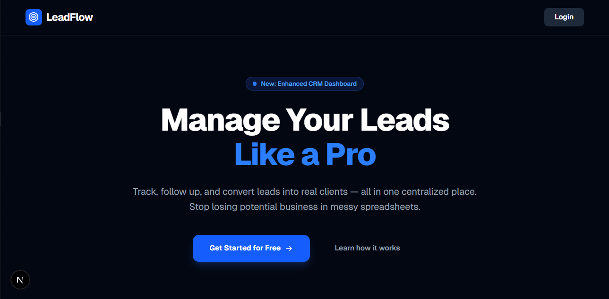
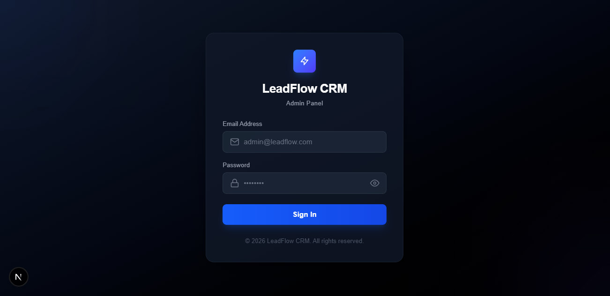
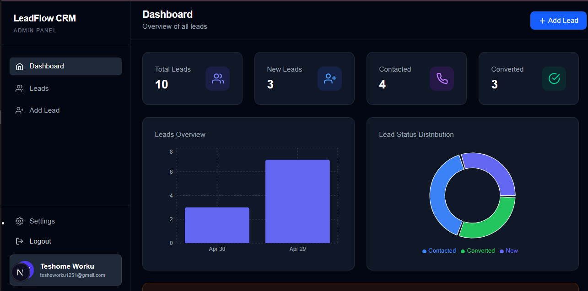
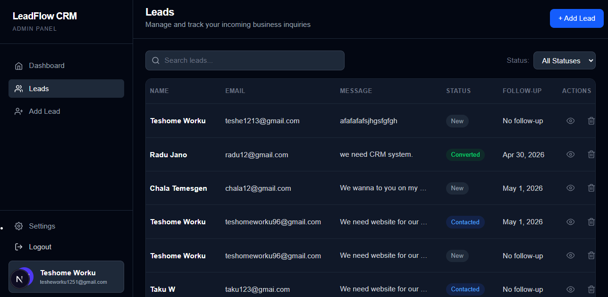
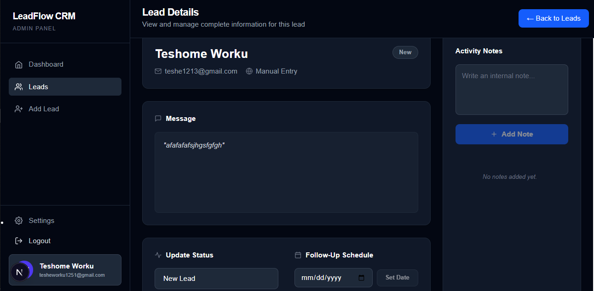
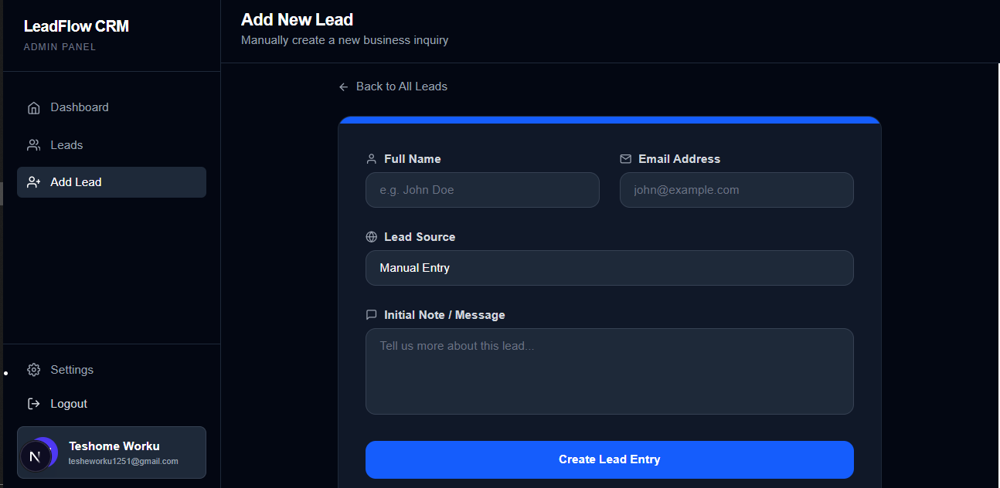
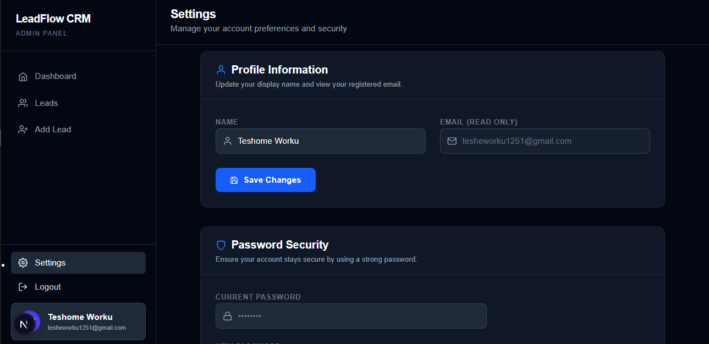

# 🚀 LeadFlow CRM

A full-stack Client Lead Management System designed to help businesses track, manage, and convert leads efficiently. Built with modern web technologies, this mini-CRM features a premium SaaS-style interface and secure backend architecture to streamline sales pipelines from first contact to successful conversion.

---

## ✨ Features

### ✅ Core Features
- **Lead Management:** Create, view, update, and delete leads seamlessly.
- **Pipeline Tracking:** Dynamic status tracking across a dedicated sales workflow (New → Contacted → Converted).
- **Follow-Up Scheduling:** Assign and track critical follow-up dates to never miss an opportunity.
- **Activity Notes:** Comprehensive internal note-taking system attached to individual leads.
- **Secure Authentication:** JWT-based secure admin authentication protecting all dashboard routes.

### 🎨 UI/UX Features
- **Premium SaaS Aesthetics:** Polished, immersive dark theme with refined typography and spacing.
- **Fully Responsive:** Flawless experience across desktop, tablet, and mobile devices.
- **Advanced Navigation:** Intuitive sidebar and header system for quick access to all modules.
- **Search & Filtering:** Real-time search and status-based filtering on the main leads pipeline.
- **Custom Modals:** Custom confirmation dialogs replacing native browser alerts for destructive actions.
- **Empty States & Loading:** Delightful empty states and loading indicators throughout the app.

### 📊 Dashboard
- **Total Leads Overview:** Key performance indicator cards for instant metrics.
- **Analytics Charts:** Visual representation of lead intake over time and status distribution (Bar and Pie charts).
- **Recent Leads Pipeline:** Quick access to the most recently added or updated leads.

---

## 🛠️ Tech Stack

**Frontend:**
- [Next.js](https://nextjs.org/) (App Router)
- React
- Tailwind CSS
- Recharts (for Data Visualization)
- React Icons

**Backend:**
- Node.js
- Express.js

**Database:**
- MongoDB (Mongoose ODM)

**Authentication & Security:**
- JWT (JSON Web Tokens)
- bcryptjs (Password Hashing)

---

## 📁 Project Structure

```text
CRM-System/
├── backend/
│   ├── config/          # Database configuration
│   ├── controllers/     # API request handlers
│   ├── middleware/      # Auth & error handling middlewares
│   ├── models/          # Mongoose database schemas
│   ├── routes/          # Express API routes
│   └── server.js        # Backend entry point
│
├── frontend/
│   ├── public/          # Static assets
│   ├── src/
│   │   ├── app/         # Next.js App Router (pages & layouts)
│   │   ├── components/  # Reusable UI components (Sidebar, Header, Modals)
│   │   ├── context/     # React Context providers (HeaderContext)
│   │   └── services/    # API integration services
│   ├── tailwind.config.js
│   └── package.json
│
├── screenshots/         # Application previews
└── README.md
```

---

## ⚙️ Setup Instructions

### 1. Clone the repository
```bash
git clone https://github.com/Teshome-Worku/FUTURE_FS_02.git
cd FUTURE_FS_02
```

### 2. Install dependencies
Install dependencies for both backend and frontend:
```bash
# Backend
cd backend
npm install

# Frontend
cd ../frontend
npm install
```

### 3. Environment Variables
Create a `.env` file in the **backend** directory:
```env
PORT=5000
MONGO_URI=your_mongo_uri
JWT_SECRET=your_secret
```

Create a `.env.local` file in the **frontend** directory:
```env
NEXT_PUBLIC_API_URL=http://localhost:5000/api
```

### 4. Run the Backend Server
```bash
cd backend
npm run dev
# Server runs on http://localhost:5000
```

### 5. Run the Frontend Client
```bash
cd frontend
npm run dev
# Application runs on http://localhost:3000
```

---

## 🔐 Demo Access

To explore the dashboard and features locally, use the following credentials:

- **Email:** `admin123@gmail.com`
- **Password:** `admin123`

---

## 📸 Preview

### Landing Page


### Login Page


### Dashboard


### Leads Pipeline


### Lead Details


### Add New Lead


### Settings



---

## 💡 What I Learned

Building LeadFlow CRM was an incredible journey that solidified my understanding of end-to-end web development:

- **Building Full-Stack CRUD Systems:** Integrating a robust Node/Express backend with a modern Next.js frontend.
- **Designing Real-World Workflows:** Translating business requirements into technical features (lead tracking, status pipelines).
- **Authentication & Secure APIs:** Implementing robust JWT authentication, password hashing, and protecting backend routes.
- **UI/UX Improvements for SaaS Products:** Crafting a premium, cohesive design system using Tailwind CSS with a strong focus on responsiveness, hover states, and micro-interactions.
- **State Management:** Using React Context effectively for dynamic UI updates across the application.
